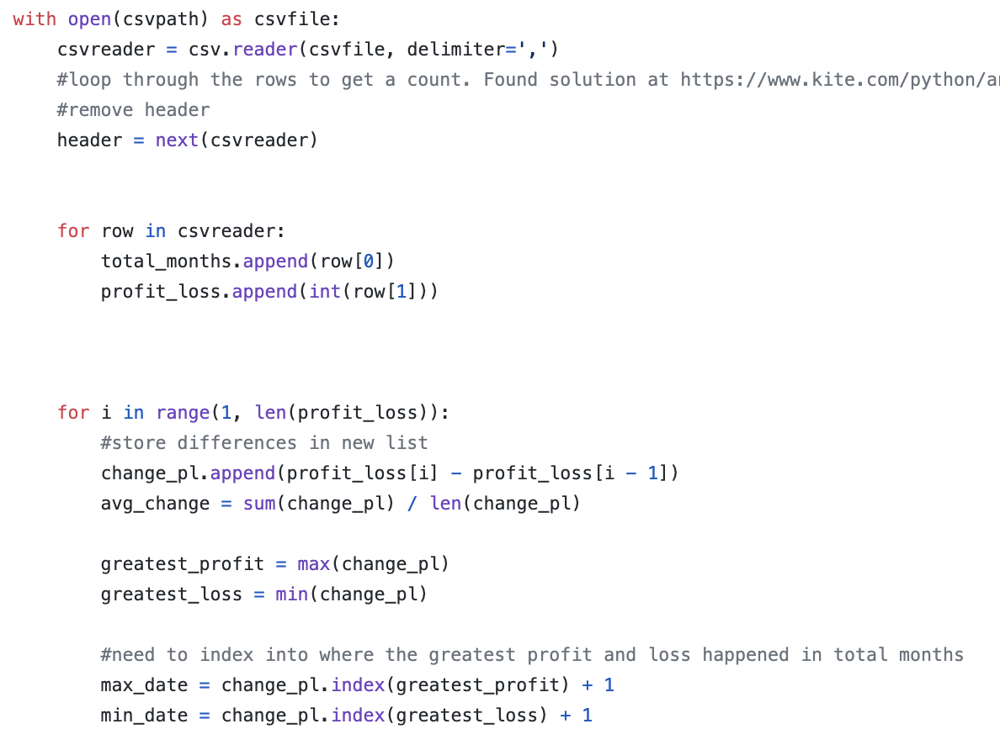
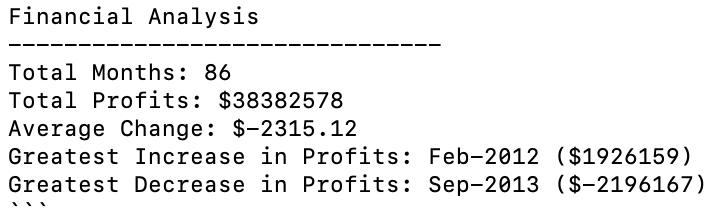
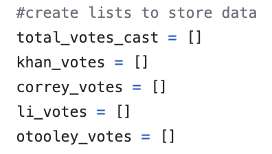
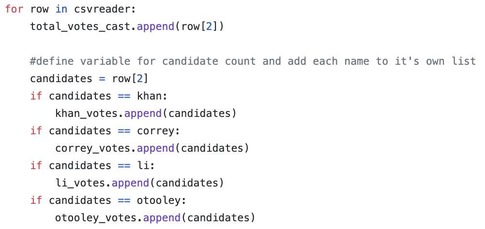
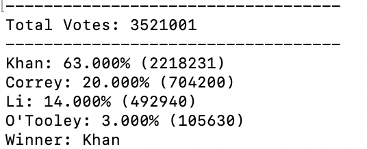

<h1 style=color:"blue"> Python Challenge </h1>

This challenge is composed of two parts.  First, we were tasked with creating a Python script for analyzing the financial records of a fictional company. Data was provided in CSV format and was composed of two columns: Date and Profit/Losses.  Our task was to analyze the records to calculate each of the following:

The total number of months included in the dataset.
The net total amount of "Profit/Losses" over the entire period
The average of the changes in "Profit/Losses" over the entire period
The greatest increase in profits (date and amount) over the entire period
The greatest decrease in losses (date and amount) over the entire period

To calculate each of these, two for loops were used and respective outputs were placed into empty lists.

Onced the data was collected, print statements were created to produce a summary analysis.

For the next part of the challenge, our task was to assist with helping a small, rural town modernize its vote counting process.
Data was once again given to us in a CSV format, with a dataset composed of three columns: Voter ID, County, and Candidate. Our task was to create a Python script that analyzed the votes and calculated each of the following:

The total number of votes cast
A complete list of candidates who received votes
The percentage of votes each candidate won
The total number of votes each candidate won
The winner of the election based on popular vote.

Similar to the first part of the assignment, empty lists were created, which would store each candidates vote count.  

To get the vote count for each candidate, nested if statements were used inside of a for loop and each reference to a candidates name was appended to the appropriate list.

Finally, print statments were created to produce a summary of the vote count and declare a winner of the election.

